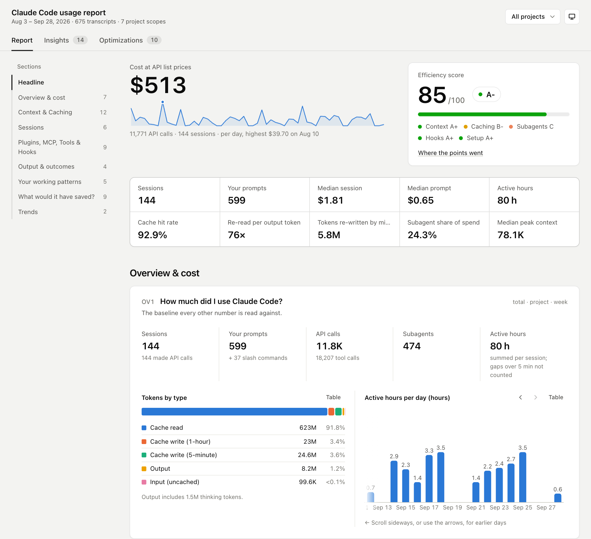
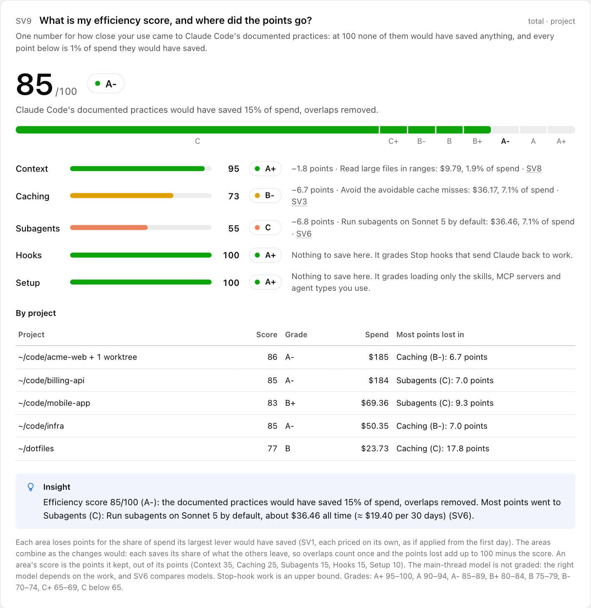
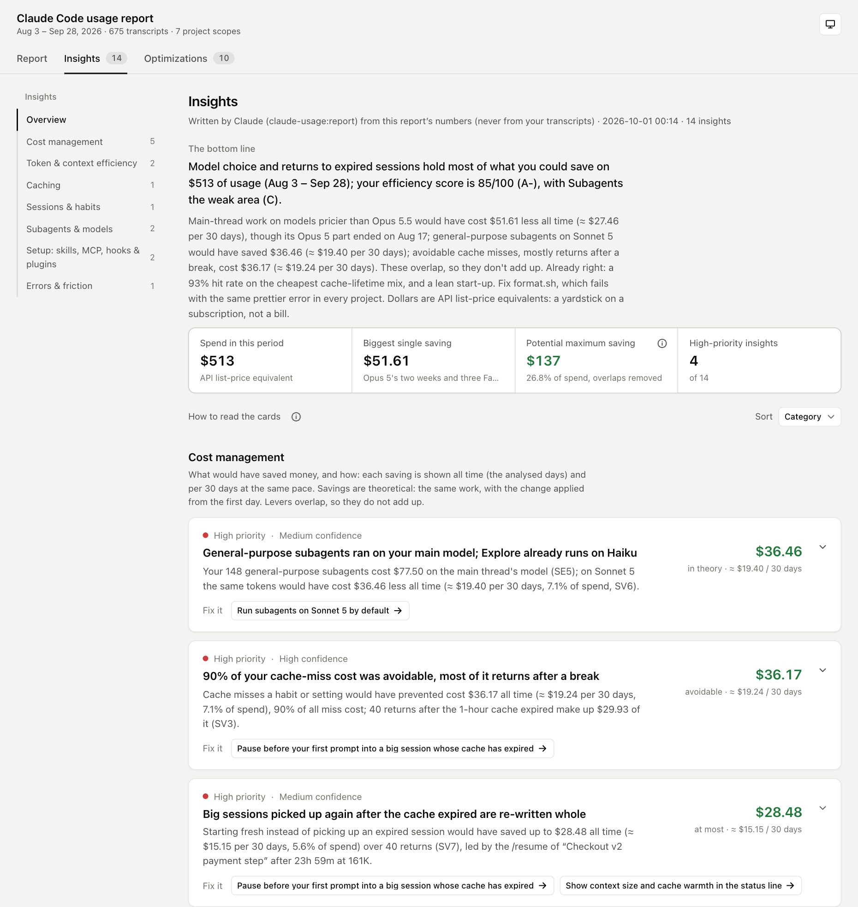
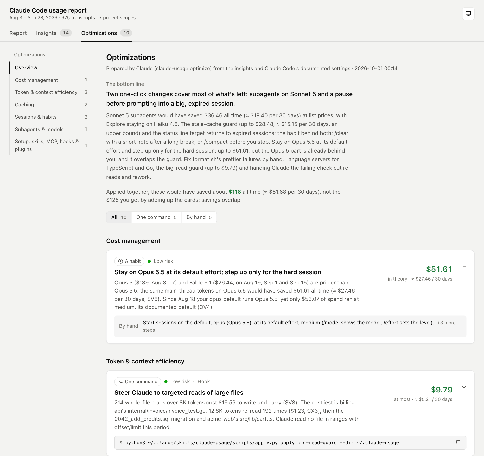
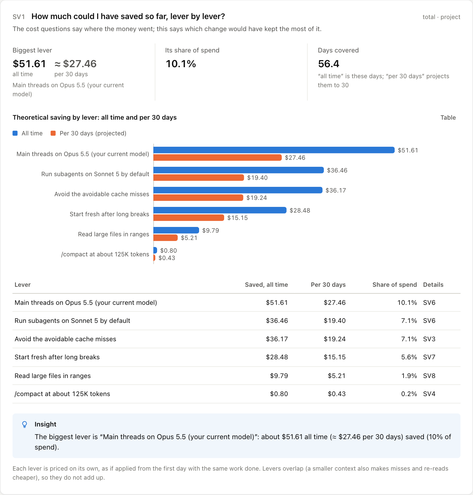
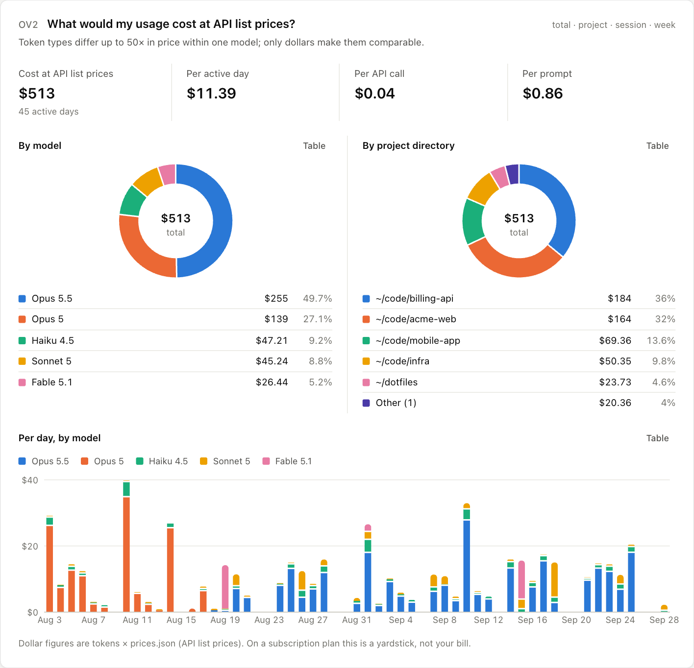
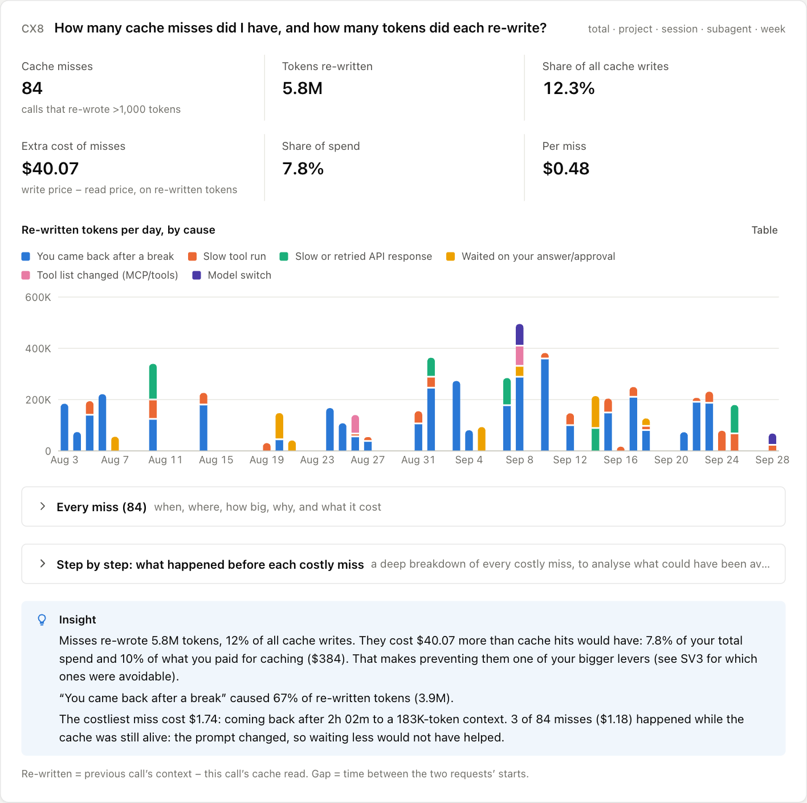
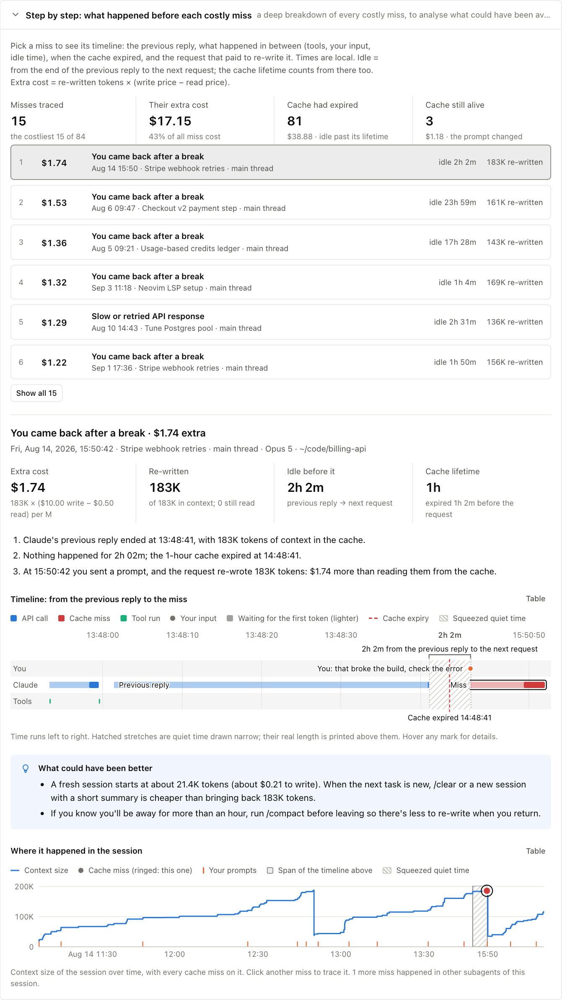

# claude-usage-optimizer

**See where your Claude Code money goes, and what would have kept it.**

[](promo/claude-usage-video.mp4)

<sub>Demo data. Watch as video: [full 53-second tour](promo/claude-usage-video.mp4) · [25-second cut](promo/claude-usage-short.mp4).</sub>

A Claude Code plugin marketplace with one plugin, **claude-usage**. It reads your local transcripts, answers 63 questions
about cost, caching, context and habits, scores how efficiently you work, and has Claude write what to change, with the
dollars each change would have saved so far. Nothing leaves your machine.

<picture>
  <source media="(prefers-color-scheme: dark)" srcset="plugins/claude-usage/docs/images/report-dark.png">
  
</picture>

<sub>All screenshots show generated demo data.</sub>

- **Report:** 63 questions, each answered with numbers and charts: cost by model, project and day, cache hits and misses,
  context growth, sessions, subagents, tools, hooks, and a step-by-step timeline of every costly cache miss.
- **Efficiency score:** one number from 1 to 100 beside your cost, with a school grade (A+ down to C) for it and for each
  area: context, caching, subagents, hooks and setup. Every point lost is 1% of spend that Claude Code's documented
  practices would have saved, overlaps removed, so the grades show where to start; All projects compares your projects.
- **Insights:** Claude reads the numbers and writes the bottom lines, cost first. Each one links to the charts behind it
  and says what it would have saved, all time and per 30 days.
- **Optimizations:** concrete changes: settings, hooks, a status line, CLAUDE.md notes, habits. Each is a way of working
  Claude Code's own documentation recommends, aimed and sized with your numbers, so a replay's saving never talks it into
  something the docs advise against (such as compacting every few turns). The ones a script can make apply with one command
  you run yourself, with a diff preview, a backup and an undo. Claude never changes your setup.

## Install

In Claude Code:

```text
/plugin marketplace add yuval-sosman/claude-usage-optimizer
/plugin install claude-usage@claude-usage-optimizer
```

Or from a shell: `claude plugin marketplace add yuval-sosman/claude-usage-optimizer`, then
`claude plugin install claude-usage@claude-usage-optimizer`. Start a new session to load it. Needs Python 3.8+ (standard
library only); runs on macOS, Linux and Windows.

## Use

```text
/claude-usage:report        build the report, write the Insights tab, open it
/claude-usage:open          open the report you already have, without building it again
/claude-usage:optimize      turn the insights into changes you can apply one by one
/claude-usage:brainstorm    dig into the numbers with Claude and test what-ifs
/claude-usage:video         a 30–60 second video of your own highlights, to share
/claude-usage:share         the whole report as one file, to send to whoever compares usage
/claude-usage:company       many people's share files combined: totals, people compared, levers company-wide
/claude-usage:clear         remove the report files to start from scratch (your setup stays)
```

Or just ask *"why did Claude Code cost so much last week?"*

```text
> /claude-usage:report

Report: ~/.claude-usage/report.html
62 days would have cost $586 at API list prices. The biggest levers:
  1. Claude re-reading files it already has: $73.02 so far (≈ $35.11 per 30 days)
  2. General-purpose subagents on Sonnet 5: $41.92 (≈ $20.16 per 30 days)
  3. Avoidable cache misses, mostly prompts into a session after a long break: $38.76 (≈ $18.64 per 30 days)
Going well: a 93% cache hit rate, and Explore agents already run on Haiku.
Next: /claude-usage:optimize turns these into changes you can apply one by one.
```

Every change shows exactly what it will do before it does it, and happens only when you type `y` at your own terminal
(Claude can preview a change, but never apply it):

```text
$ python3 …/claude-usage/scripts/apply.py apply subagents-on-sonnet
Run general-purpose subagents on Sonnet 5  [subagents-on-sonnet]
  Add CLAUDE_CODE_SUBAGENT_MODEL=sonnet to the env block of ~/.claude/settings.json; nothing else in the file changes.
    --- ~/.claude/settings.json (now)
    +++ ~/.claude/settings.json (after)
    @@ -41,4 +41,7 @@
           "Bash(git diff:*)"
         ]
    +  },
    +  "env": {
    +    "CLAUDE_CODE_SUBAGENT_MODEL": "sonnet"
       }
     }

Apply these changes? [y/N] y
Applied “Run general-purpose subagents on Sonnet 5”.
Undo:  python3 …/claude-usage/scripts/apply.py undo subagents-on-sonnet --dir ~/.claude-usage
```

## A look inside

<details open>
<summary><b>Efficiency score</b>: 1 to 100, with a grade for each area</summary>


</details>

<details open>
<summary><b>Insights</b>: the bottom lines, each with what it would have saved</summary>


</details>

<details>
<summary><b>Optimizations</b>: a list, with the choices between changes</summary>


</details>

<details>
<summary><b>Savings</b>, lever by lever</summary>


</details>

<details>
<summary><b>Cost</b> by model, project and day</summary>


</details>

<details>
<summary><b>Cache misses</b>: how many, why, and what the re-writes cost</summary>


</details>

<details>
<summary><b>Step by step</b>: what happened before each costly miss</summary>


</details>

## More

<details>
<summary><b>The 63 questions</b></summary>

| Section | For example |
|---|---|
| Overview & cost | What would my usage cost at API list prices? Which token type dominates the bill? What's my total waste? |
| Context & caching | How big does my context get, and what is it made of? How many cache misses did I have, and why? Does my cache lifetime fit my pauses? |
| Sessions | How long are my sessions? Which prompts were most expensive? Do subagents pay off? |
| Plugins, MCP, tools & hooks | What loads into every session but never gets used? What do my hooks cost? Which files does Claude re-read? |
| Output & outcomes | How much code did Claude change, and what do 100 changed lines cost? In which languages? |
| Your working patterns | When do I work? How often do my pauses outlast the cache? |
| What would it have saved? | My efficiency score, and where did the points go? Avoidable misses, when to /compact, another model, fresh sessions after breaks, reading files in ranges. |
| Trends | What drove my cost week to week? What changed when my setup changed? |

Each question, how it's counted and how to check it: [docs/QUESTIONS.md](plugins/claude-usage/docs/QUESTIONS.md).
</details>

<details>
<summary><b>All options</b>: skills, scripts and environment variables</summary>

**Skills.** You can also ask in words ("report on the last 3 months", "optimize for cache") and Claude picks the options.

| Command | Options |
|---|---|
| `/claude-usage:report` | `--days N` (default 60) · `--since YYYY-MM-DD --until YYYY-MM-DD` · `--all` (every transcript on disk) · `--claude-dir DIR` · `--no-insights` (numbers only) · `--no-open` |
| `/claude-usage:open` | `insights` or `optimizations` (the tab) · a question, insight or optimization id, e.g. `CX8` · `company` · `received [NAME]` (a report someone sent you) |
| `/claude-usage:optimize` | a focus: `cost`, `cache`, `context`, `hooks` or anything else · `apply <id>`: preview one optimization and get the command to apply it yourself |
| `/claude-usage:brainstorm` | a question or topic, e.g. `why are subagents so expensive?` |
| `/claude-usage:video` | what to highlight, e.g. `cache misses and savings` · `--seconds 30-60` · `--no-mp4` |
| `/claude-usage:share` | `--name NAME` · `--team TEAM` · `--no-open` · `open FILE`: open a share file someone sent you |
| `/claude-usage:company` | `<folder of share files>` · `--since YYYY-MM-DD` · `--until YYYY-MM-DD` · `--no-open` |
| `/claude-usage:clear` | `--yes` (skip the question) · `--keep video,share,received,company` · `--out DIR` |

```text
/claude-usage:report --days 30
/claude-usage:report --since 2026-09-01 --until 2026-09-15
/claude-usage:report --all --no-open
/claude-usage:optimize cache
/claude-usage:optimize apply context-guard-150k
```

**The report without Claude**, in about 5 seconds, from a clone of this repo (or the copy Claude Code keeps in
`~/.claude/plugins/marketplaces/claude-usage-optimizer/`). With `S=plugins/claude-usage/scripts`, run
`python3 $S/usage_report.py [options]` (or `$S/usage-report.sh [options]`):

| Option | What it does |
|---|---|
| `--days N` | only the last N days (default 60), counted back from `--until` when given |
| `--since YYYY-MM-DD`, `--until YYYY-MM-DD` | the first and last day to include (local time) |
| `--all` | every transcript on disk, however old |
| `--claude-dir DIR` | the folder Claude Code keeps its data in (with `projects/` inside); default `$CLAUDE_CONFIG_DIR`, else `~/.claude` |
| `--projects DIR` | the transcripts folder, if not `<claude dir>/projects` |
| `--out DIR` | the output folder; default `$CLAUDE_USAGE_OUT`, else `<claude dir>-usage` (`~/.claude-usage`) |
| `--open`, `--tab report\|insights\|optimizations` | open the report when done, on that tab |
| `--render` | only rebuild report.html from the data and your edited insights/optimizations (no recounting) |
| `--where` | print the Claude folder and the output folder it would use, then exit |
| `--no-csv` | skip the CSV exports |
| `--quiet` | no progress output |
| `--prices FILE`, `--template FILE` | another price table or HTML template |

**Applying optimizations**: `python3 $S/apply.py <command> [id] [--dir DIR] [--claude-dir DIR]`

| Command | What it does |
|---|---|
| `list` | what can be applied, and what already is |
| `check` | preview every optimization in one call, one line each (nothing is written) |
| `show <id>` | the exact changes for one, as a diff (nothing is written) |
| `apply <id>` | preview, ask you at your terminal, back up, apply (without a terminal, e.g. from Claude, it changes nothing) |
| `undo <id>` | preview, ask you, revert just that change; later changes to the same files are kept |

`--dir` is the report folder (default as for `--out`); `--claude-dir` is the Claude folder to change (default: the one
the report was built from).

**Opening a report again**: `python3 $S/open.py [--tab insights|optimizations] [--show ID] [--company | --received [NAME]] [--out DIR]`
opens the report you already have (or the company report, or one someone sent you) without counting anything again, and
says when its numbers were counted and whether its insights and optimizations are current. A page older than the files
it is built from (or than the plugin's page, after an update) is built again from them first; the numbers stay the same.

**Starting from scratch**: `python3 $S/clear.py [--yes] [--keep video,share,received,company] [--out DIR]` shows what it
would remove from the report folder, and removes it with `--yes`: only this plugin's own files, never your settings or
transcripts. `applied/` stays while an optimization is applied, so `apply.py undo` keeps working.

**The video**: `python3 $S/video.py <command> [--out DIR]`

| Command | Options |
|---|---|
| `tools` | can this machine make the MP4 (a Chromium-based browser and ffmpeg)? If not, how to install them |
| `plan` | `--seconds 30-60`: draft the storyboard |
| `check` | check the storyboard: length, ids, numbers, no private names |
| `render` | `--no-mp4` (the page only) · `--open` · `--stills 3,20` (PNG frames instead) · `--fps N` · `--scale N` · `--browser PATH` · `--ffmpeg PATH` |

**Sharing**: `python3 $S/share.py <command> [--out DIR]`

| Command | What it does |
|---|---|
| `pack` | `--name NAME` · `--team TEAM` · `--reveal`: write the whole report as one file to `<out>/share/` |
| `unpack FILE` | `--to DIR` · `--open`: turn a share file back into a report folder (default `<out>/received/<file name>/`) |

**The company report**: `python3 $S/company.py build FOLDER [--to DIR] [--since D] [--until D] [--open] [--quiet]`
combines every share file in FOLDER into `<out>/company/` (report.html, data/digest.md, data/people.csv).

**What the skills run for you** (rarely needed by hand):
- `candidates.py --out DIR [--show SECTIONS] [--brief]`: the optimization drafts and savings bundles;
  `--show card:CX3` prints every figure of one card.
- `assemble.py insights|optimizations --out DIR [--notes FILE]`: builds insights.json or optimizations.json from
  Claude's notes, and writes it only when it validates.
- `validate.py insights|optimizations FILE --metrics <out>/data/metrics.json [--insights <out>/insights.json]`: checks
  either file against the report (and optimizations' links against the insights).

**Environment variables**

| Variable | What it sets |
|---|---|
| `CLAUDE_CONFIG_DIR` | where Claude Code keeps its data (Claude Code reads it too) |
| `CLAUDE_USAGE_OUT` | the output folder, instead of `~/.claude-usage` |
| `PYTHON` | the Python `usage-report.sh` runs, when `python3` isn't on your PATH (common on Windows; `python` works too) |
| `CLAUDE_USAGE_BROWSER`, `FFMPEG` | the browser and ffmpeg the video uses |
| `CLAUDE_USAGE_HOOK_STATE` | where the installed hooks keep their small state files (default: beside the hooks) |
</details>

<details>
<summary><b>Applying and undoing an optimization</b></summary>

Each one-command card in the Optimizations tab has a **Copy** button for its `apply.py apply <id>` command, to run in
your terminal. It shows a diff per file and writes nothing until you type `y` there, backs up every file it touches, and
can only change what [`scripts/policy.py`](plugins/claude-usage/scripts/policy.py) allows (see Privacy and safety).
`apply.py undo <id>` removes just that change and keeps other optimizations and your own later edits. `apply.py list`
shows what's applied, and `apply.py check` previews them all in one go. Settings and hooks take effect in new sessions.

The tab shows how optimizations interact:
- **Pick one**: two fixes for the same cost (e.g. the stale-cache guard vs a 1-hour cache) appear as one choice. Mark the one
  you pick as done and the other is set aside as not needed.
- **Do first**: a change that needs another shows it, and whether it's done yet.
- **Saving shared with** and **Works well with**: listed inside each card.
- The top of the tab gives the combined saving, with overlaps removed and each choice counted once.

`apply.py` warns before you apply one whose alternative is already applied.

Hooks it can install (copied to `~/.claude/hooks/claude-usage/`, so they keep working if the plugin moves or updates):
- **Stale-cache guard:** holds the first message into an expired, big session and shows what it would cost.
- **Context notice:** a line of text once the context passes your break-even size.
- **Big-read guard:** asks Claude to grep first, then read a range.
- **Status line:** context size and cache countdown.
- **Keep-awake:** macOS only.

They fail open: an error in a hook never blocks you.
</details>

<details>
<summary><b>A video of your own highlights</b></summary>

`/claude-usage:video` turns your report into a square video to post (LinkedIn, Slack, a team update), in the style of the
one above: what your usage cost with its daily spend, the headline numbers, cost by model, your costliest cache miss step by
step, the top insights, the optimizations (applied ones checked) and what they would save together. Tell it what to focus
on and it picks and words the scenes; it runs 30 to 60 seconds.

- Every figure comes from your report's data; a headline can only quote a number the data has.
- It leaves out project names, session titles, file paths and prompts unless you ask for them.
- It writes `~/.claude-usage/video/claude-usage-video.mp4` (1080 × 1080, H.264) and `video.html`, which plays the same
  video in a browser, offline. The MP4 needs Chrome (or Edge, Chromium, Brave) and ffmpeg. The skill checks for both
  first and, if one is missing, gives you the command to install it yourself; it never installs anything. Without them
  you still get the page, ready to screen-record.
</details>

<details>
<summary><b>Sharing the whole report</b></summary>

`/claude-usage:share` packs your report into one JSON file, made when you ask, to send to someone who collects and
compares usage across people (a team lead, a platform team):

- It holds everything report.html holds, and more: every number, chart, table and miss trace of every project scope, the
  insights and optimizations, the optimization drafts, your setup (secrets redacted), the optimizations you applied, and
  every row of the CSV exports, with numbers as numbers. The format is `plugins/claude-usage/schemas/share.schema.json`.
- It writes `~/.claude-usage/share/claude-usage-share-<name>-<date>.json` and shows it in your file manager. Add
  `--name` and `--team` to say who it is from. It tells you when the report is days old or the insights are out of
  date, so you can refresh them first.
- It includes project names, session titles, file paths, prompt snippets and commands, like report.html (keys, tokens
  and passwords in them are replaced by `<redacted>`, as far as they can be recognised). Send it only to someone you
  would show your report to.
- Whoever gets it runs `/claude-usage:share open <file>`: it becomes a report folder in `~/.claude-usage/received/`
  with its own report.html, showing who shared it and without the apply commands (those optimizations are for the
  sender's machine).
</details>

<details>
<summary><b>A company report from many people's files</b></summary>

Collect people's share files in one folder and run `/claude-usage:company <folder>`. It builds one page for everyone
(`~/.claude-usage/company/report.html`) and Claude sums it up:

- **Company**: spend per 30 days and the weekly trend, by model and platform (Claude API or Bedrock, global or regional),
  cache hit rate and what misses cost, context sizes.
- **People**: one row each, compared per 30 days of their own period (people send files covering different days); who
  stands out and why.
- **Savings levers**: which change (model mix, compacting earlier, cache misses, Stop hooks, unused skills and servers…)
  would save the most across everyone, and for how many people.
- Every call is re-priced at this plugin's prices, so everyone is priced the same way. Savings come from each person's
  own report. The same person's files from two machines are merged, and an older copy of the same history is dropped; the
  page lists every file it left out, and why.
- It shows each person's name (or computer account) but no project names, session titles or prompts. The person selector
  shows one person's figures against the company median. Every card is explained in
  [docs/COMPANY.md](plugins/claude-usage/docs/COMPANY.md).
</details>

<details>
<summary><b>Where it reads and writes</b></summary>

It reads the transcripts Claude Code keeps in `<claude dir>/projects`. `<claude dir>` is `--claude-dir DIR`, else
`$CLAUDE_CONFIG_DIR`, else `~/.claude` (`%USERPROFILE%\.claude` on Windows). `apply.py` writes every `~/.claude/…` path
of an optimization to the Claude folder the report was built from (or its own `--claude-dir`).

It writes to a folder next to the Claude folder, `~/.claude-usage/` by default. That folder is outside `~/.claude`,
where Claude Code guards every write. To change it, pass `--out DIR`, or set `CLAUDE_USAGE_OUT` in your shell profile.

```
~/.claude-usage/
├── report.html          open this: Report · Insights · Optimizations, a project selector, light and dark themes
├── insights.json        written by /claude-usage:report; yours to edit
├── optimizations.json   written by /claude-usage:optimize
├── data/                rebuilt on every run: metrics.json, digest.md and candidates.json (what Claude reads), config.json, *.csv
├── video/               /claude-usage:video: storyboard.json, video.html and claude-usage-video.mp4
├── share/               /claude-usage:share: the one-file copies of your report you made to send
├── received/            share files others sent you, each unpacked into its own report folder
├── company/             /claude-usage:company: many people's share files combined (report.html, data/)
└── applied/             once you apply something: applied.json and backups/
```
</details>

<details>
<summary><b>Any model, any machine</b></summary>

- Model ids from the API, Bedrock (`us.anthropic.claude-sonnet-4-5-20250929-v1:0`, `global.anthropic.claude-opus-4-6-v1`,
  `anthropic.claude-opus-5`), Vertex (`claude-sonnet-4-5@20250929`) and older names (`claude-3-5-sonnet-20241022`) all
  resolve to one canonical id before pricing.
- Bedrock and Claude API prices match at list, and global routing stays at list on both (`global.` profiles,
  `inference_geo: "global"`). What the transcripts show costing more is priced that way: a regional Bedrock inference
  profile (`us.`, `eu.`, `apac.`, `jp.`, `au.`…) costs 10% more for Claude 4.5 and later, Claude API inference pinned to one
  location (`inference_geo: "us"`) 10% more for Claude 4.6 and later, and fast mode its premium. Native Claude Code calls
  are priced exactly as before. The report's notes say where the calls ran when any went through Bedrock or a pinned
  location.
- A Bedrock application inference profile ARN names no model. The report maps it through `modelOverrides` in your settings,
  or `ANTHROPIC_DEFAULT_OPUS_MODEL` (and SONNET, HAIKU) set to it (the family only, so it is flagged as estimated); add it to
  `_aliases` in `scripts/prices.json` to price it exactly.
- `scripts/prices.json` covers Claude models from Claude 3 on. An unlisted Claude model is priced like the nearest version
  of its family and flagged as estimated; a non-Claude model counts as $0. Add a line to price one exactly.
- Older transcripts that don't mark typed prompts are handled.
</details>

<details>
<summary><b>How the numbers stay honest</b></summary>

- A deterministic script does all the counting. Claude only reads what it extracted, never your transcripts.
- Dollars are API list-price equivalents. On a subscription they are a yardstick, not your bill.
- Savings re-price your actual calls as if one change had been in place from day one. They are theoretical and they
  overlap, and the report says so: optimizations that go after the same cost are linked as alternatives or overlaps.
- `scripts/validate.py` checks Claude's output against a schema. It checks:
  - that every cited question exists;
  - that every cost insight states its saving and basis;
  - that no saving exceeds total spend;
  - that optimizations changing the same setting, or acting on the same cost, say how they relate.

  The skills run it until it passes.
- Rebuilding the report marks older insights **out of date** until the report skill runs again.
</details>

<details>
<summary><b>Privacy and safety</b></summary>

- **Local only.** The scripts use no network and send no telemetry. report.html and video.html carry a Content Security
  Policy that blocks every network request, whatever the data holds. The browser that draws the video runs with a
  throwaway profile and no network, driven over a private pipe rather than a port.
- **Yours only.** The output folder is created readable by you alone (and made so on every run), and the scripts refuse
  to write into your home folder, the Claude folder or any folder that isn't a report folder. The report contains prompt
  snippets, file paths and session titles, so treat it like your transcripts. Keys, tokens and passwords in settings,
  commands, prompts and titles are replaced by `<redacted>` (by pattern: it catches the common forms, not every secret),
  environment variables other than Claude Code's own show as `<set>`, and MCP servers are listed by name only.
- **Least privilege for Claude.** Each skill pre-approves only its own scripts, by their full path in the plugin, reads
  only the report folder (and the plugin's own reference files), and writes only the one notes file it owns. Anything
  else (another command, `python3 -c`, a transcript, a file elsewhere) goes through Claude Code's normal permission
  prompt. Only `/claude-usage:report` can start without you typing it; the others run only when you do.
- **Nothing changes without you.** `apply.py apply` and `undo` write only after you type `y` at your own terminal;
  Claude Code's tools have no terminal, so Claude can preview a change but never make it. What an optimization can change
  at all is fixed in [`scripts/policy.py`](plugins/claude-usage/scripts/policy.py): copies of the bundled hooks in
  `~/.claude/hooks/claude-usage/`, a marked block in `~/.claude/CLAUDE.md`, and a short list of settings keys (model,
  effort, cache lifetimes, compaction, skill listing, switching plugins or MCP servers off, output limits, a few model and
  cache environment variables, and hooks or a status line that run the bundled scripts). It never runs a command, never
  touches permissions, API keys or endpoints, MCP definitions or your own hooks, never shortens transcript retention, and
  undo restores only from its own backups.
- **Nothing installed.** The plugin adds no hooks, MCP servers or background processes of its own; hooks exist only if
  you apply an optimization that installs one, and they fail open. The video skill never installs a browser or ffmpeg:
  it tells you the command.
- **Files from others.** A share file someone sends you is treated as untrusted: its size and nesting are capped, its
  text is shown without control characters, it can't bring a command to the page, and it is unpacked only into a new
  folder. The video, meant for sharing, shows numbers only: no prompts, and no project names, session titles or paths
  unless you ask. The share file (`/claude-usage:share`) is the opposite: it holds all of the report, names and prompt
  snippets included, and leaves your machine only when you send it.
</details>

<details>
<summary><b>Repository layout</b></summary>

```
.claude-plugin/marketplace.json      the marketplace: one plugin, claude-usage
CLAUDE.md                            for working on the plugin
plugins/claude-usage/
  .claude-plugin/plugin.json         the plugin manifest
  skills/report|open|optimize|brainstorm|video|share|company|clear/  the eight skills and their reference guides
  scripts/usage_report.py            the engine (stdlib Python 3.8+); report_template.html is the offline UI
  scripts/apply.py, validate.py      apply/undo optimizations; check Claude's output
  scripts/candidates.py, assemble.py the optimization drafts and savings bundles; merge Claude's notes into the final JSON
  scripts/video*.py, fonts/          the highlights video: storyboard, checks, template, recorder (headless browser + ffmpeg)
  scripts/share.py                   the whole report as one file to send, and back into a report folder
  scripts/company.py                 many people's share files combined into one company report
  scripts/open.py                    open a report you already have, without building it again
  scripts/clear.py                   remove the report folder's files to start from scratch
  scripts/prices.json                USD per million tokens per model
  scripts/hooks/                     hooks and status line the optimizations install
  schemas/                           the insights, optimizations, video storyboard and share file contracts
  docs/QUESTIONS.md                  every question: why, how, what it found
  docs/COMPANY.md                    the company report's cards: why, how, how to check
  docs/screenshots/                  the made-up data and script behind docs/images/
promo/                               the launch videos (HTML), their MP4s and GIFs, and render.mjs
```

Disable with `claude plugin disable claude-usage@claude-usage-optimizer`; remove with
`claude plugin uninstall claude-usage@claude-usage-optimizer`.
</details>
